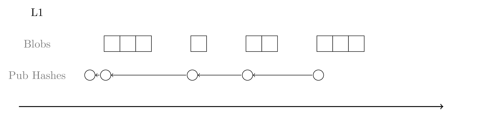
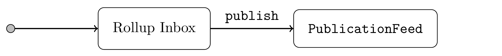
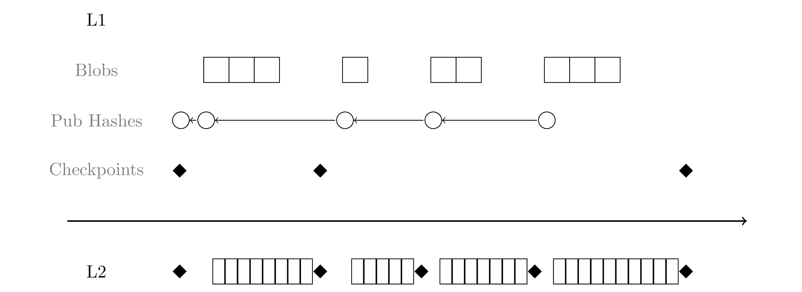
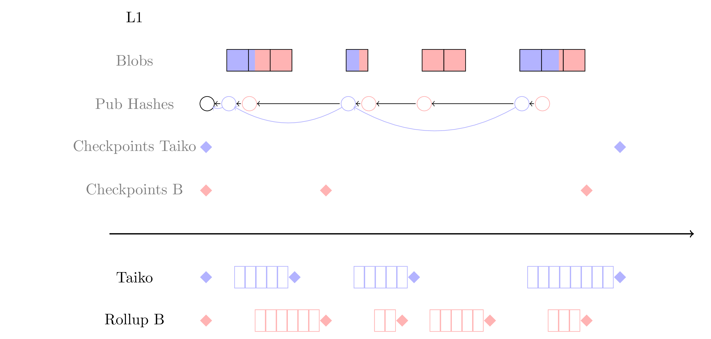

# Overall Design

To better highlight the compromises, design choices that increase L1 costs are described like this.

## Minimal Publications

Recall, a rollup requires:

- all relevant data to be available on L1
- a mechanism to convert the L1 data to an L2 state

We want to minimize L1 processing, so for each L1 transaction we simply denote all the blobs and any relevant L1 data as a "publication" and save the publication hash in L1 storage (in the `PublicationFeed` contract).

All L2 validations occur off-chain, so publications never revert. Invalid publications will be no-ops, but this fact is part of the actual L2 state transition function (so L2 nodes will still process the publication and provers will prove that they are no-ops). This should not happen in practice because there is no reason for anyone to publish a no-op.

Technically, the rollup-specific contract may still choose to revert publication transactions. The execution flow is:

- the publisher sends a message to the rollup inbox.
- the inbox performs validations, specifies the relevant blobs, and potentially adds additional data.
- the inbox saves the publication in the `PublicationFeed` contract.

For example, the `TaikoInbox` contract reverts if:

- the publisher is not the expected preconfer
- the specified anchor block (supposed to be a recent L1 block) is too old or in the future.

In principle these could be checked on L2 but they are properties of the L1 state so it seems natural (and simpler) to perform those validations on L1. Moreover, the preconfer check relies on the Universal Registry Contract, which exists on L1 and is not designed for easy portability.

In any case, it is up to the rollup node to convert the data referenced by the publication hashes into a sequence of L2 blocks.

## Checkpoints

We define a checkpoint as the L2 block hash after applying all the transactions in a publication. This means there is an implicit L2 checkpoint per publication and a publication is the smallest unit of proving. However:

- each publication hash references the previous one, which means it is possible to validate the chain of values between any two publication hashes.
- this implies a prover can make a proof over any number of publications. The proving market creates a liveness incentive but otherwise there are no restrictions on proof size or frequency, so provers are free to optimize and aggregate (potentially across different rollups) however they want.
- we only save a checkpoint to the L1 (in the rollup's `CheckpointTracker` contract) when it has been proven. The prover specifies the relevant publications when submitting a proof.

We expect most proofs to span several publications, so most checkpoints will not be posted to L1. Morever, the current proving market design does not require multiple simultaneous provers, so for simplicity, we do not support parallel proving (i.e. each proof must start from the latest proven checkpoint). Only the latest proven checkpoint is saved in storage (overwriting the previous one).

## Delayed Inclusion

Any rollup can introduce a delayed inclusion mechanism by deferring calls to the `publish` function. In the Taiko case:

- there is a `DelayedInclusionStore` contract that accepts publications from anyone.
- after every publication, the `TaikoInbox` queries the `DelayedInclusionStore` and publishes everything that is due for inclusion.

There is a separate publication hash per delayed inclusion. We could create one publication for all sequential delayed inclusions or even one per L1 transaction, but this complicates the proving pricing model (described in another document).

## Shared Blobs

We support blob sharing by simplying allowing blobs to contain transactions destined for different rollups, without making any attempt to disentangle them on L1. Rollup nodes must be designed to filter out irrelevant transactions.

## Shared Publication Feed

Our current design uses the same `PublicationFeed` contract for all rollups within the stack. The intention is to allow:

- different rollups to share sequenced coordination information (eg. like [this mechanism](https://github.com/OpenZeppelin/minimal-rollup/issues/57)).
- all transactions to be naturally sequenced across all rollups.

These properties seem like they should be useful for composability. However:

- we have not yet designed any features that rely on them.
- the shared feed undermines the ability to recognise when a publication is no longer required, so  it prevents the use of a ring buffer.

If we do not implement any composability features, we should restore the different publication feeds per rollup so the implementation can be optimised.

## Non-shared Publications

The original design included a shared publication feed, with one publication hash per L1 transaction (shared among all rollups). However:

- each rollup may optionally include L1 information with the publication. The hook mechanism we implemented for querying all the rollups was convoluted.
- the proving mechanism charges per publication, so shared publications require coordination and compromise between the rollups.

Instead, a publisher is expected to call the inbox of every rollup that should process the blobs to create a separate publication per rollup. Note that the possibility of delayed inclusions implies that different publications that share the same blobs are not necessarily consecutive within the feed.

As an optimization, the `TaikoInbox` contract includes a pointer to the previous Taiko publication so provers do not need to process the irrelevant publications.

