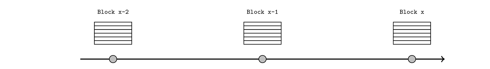
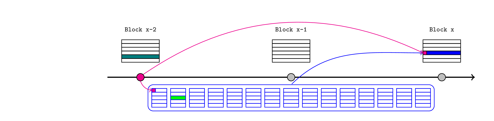
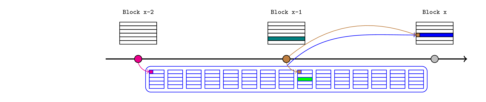
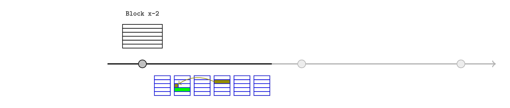

# Preemptive Provable Assertions

## Overview

I'd like to describe a mechanism to extend the flexibility of rollups. I learned the core insight through Taiko's anchor transaction mechanism and Nethermind's [Same Slot L1->L2 Message Passing](https://ethresear.ch/t/same-slot-l1-l2-message-passing/21186) design, and I would generalise it to the statement:

> L2 users (and contracts) can rely on arbitrary assertions about future state, provided their transactions are conditioned on those assertions eventually being proven.

This article will unpack that statement and provide some example use cases. We will cover:

- Background information about rollup communication, focussing on timing.
- Anchor blocks for reading L1 state.
- Same-slot message passing.
- A mechanism for realtime L1 reads.
- A mechanism for interdependent L2 transactions.
- Mechanisms for cross-rollup assertions.
- A suggested implementation framework.

## Background

Every 12 seconds, Ethereum selects an L1 proposer that can aggregate new L1 transactions into a block and add it to the chain. 

<p align="center"></p>

L2 transactions are derived from data published in an L1 transaction. Typically, they are aggregated into L2 blocks with a shorter block time, so there are several L2 blocks per L1 block.

<p align="center"></p>

We are focussed on potential functionality that can be offered by an L2 sequencer with monopoly rights until a particular slot, typically spanning several L1 blocks (although just two are depicted here).

<p align="center"></p>

Such a sequencer would be partially limited in their flexibility to reorganise L2 transactions over several slots, because they may offer preconfirmations or liveness guarantees to users. Whenever we discuss a transaction occurring on L2 before it is actually published to L1, we really just mean that it can influence later transactions and the sequencer is unlikely to remove or delay it. For simplicity, this article will default to describing L2 blocks as if they are continuously created and finalized in real time.

## Anchor blocks

We need a mechanism to send messages from L1 to L2, so that L2 users and contracts can react to L1 activity. I will describe Taiko's standard architecture, although the concepts are broadly applicable across rollups.

The L2 sequencer is required to start each block with an _anchor transaction_, and pass in a recent L1 block number and state root as arguments. Any user can then prove that a particular storage value is consistent with the latest state root, and the rest of the chain can proceed with this knowledge.

For example, consider a scenario spanning a cross-chain token deposit and a few subsequent L2 blocks:

- an L1 bridge contract receives the tokens and records this fact in L1 storage (the dark green transaction in the below diagram).
- the L2 sequencer passes the latest L1 state root (pink) to the anchor transaction at the start of an L2 block.
- the token recipient (or anyone else) provides a Merkle proof to an L2 bridge contract demonstrating that the deposit was saved under the relevant storage root within the L1 state root. This convinces the L2 bridge that the deposit occured on L1, so it releases or mints the L2 tokens (light green).
- those tokens are now immediately available to interact with the rest of the L2 ecosystem in future transactions and blocks.

<p align="center"></p>

Note that at this point the sequencer has directly asserted the L1 state without justification. Although it is public information (in the sense that anyone can retrieve the value from an L1 node), this cannot be validated from inside the L2 EVM so L2 contracts must simply trust that it was correct. A sequencer that passes an invalid state root could fabricate a plausible alternate history that would be self-consistent from within the L2 EVM. This is eventually resolved when the bundle is published to the L1 inbox contract, which queries the relevant block hash so it can be compared to the injected state root.

<p align="center"></p>

### Security architecture

Let's review the security architecture implied by this mechanism. Constraints on L2 sequencers can be categorised as either:
- rules of the rollup, enforced by the L2 nodes and validity proofs.
- other commitments (such as preconfirmations), enforced by economic stake and reputation.

The anchor block requirement (and other assertions described in this article) fall into the first category. This means that all relevant information needs to be available on L1 and when using ZK or TEE proofs, it also needs to be verifiable from within the L1 EVM. This is achieved by some combination of:
- performing relevant validations in the L1 Inbox contract at publication time.
- saving a hash of the available information at publication time, so it can be use to constrain the inputs to an off-chain proof.

In this case, the complete procedure is:
- the sequencer reads the latest L1 state and block number from their node.
- the sequencer passes these values to the anchor transactions, which saves them in the L2 state.
    - in the Taiko case there is an anchor transaction per L2 block but only ones that update the latest L1 state are relevant for this article.
- the sequencer continues to build L2 blocks, and possibly preconfirms them.
- eventually the sequencer submits the whole bundle to the L1 Inbox contract.
- the Inbox contract calls `blockhash(anchorBlockNumber)` and saves (a hash of) it along with the publication.
- the rollup's state transition function, implemented by the rollup nodes, validates the consistency of the entire bundle, which includes confirming (among many other things) that:
    - the anchor transaction is called exactly once at the start of every block.
    - the block number and state root arguments are consistent with the block hash queried by the L1 inbox.

In this way, a sequencer that asserts the wrong state root would invalidate the whole publication, just like they would if they violated any other state-transition rules like exceeding the block gas limit. Any L2 transaction that reacted to the invalid root (by minting tokens that did not have a matching L1 deposit, for instance) would be contained inside an invalid publication, so it would not be included in the final transaction history.

As we have seen, the sequencer's claim when constructing the anchor transaction is not strictly "this is the state root of the latest L1 block" but rather "this state root is consistent with the block hash that will be retrieved in the publication block". This describes a general pattern that we can use whenever:

- the sequencer knows something that they want to assert inside the L2 EVM, so that L2 users and contracts can build on it.
- the information needed to prove the claim will eventually be verifiable in the L1 EVM at publication time.
- the rollup's state transition function requires the claim to be proven for the publication to be valid.


## Same Slot Message Passing

This idea was [introduced by Nethermind](https://ethresear.ch/t/same-slot-l1-l2-message-passing/21186) and as noted in that post, it can be combined with their fast-withdrawal mechanism to perform a same-slot round-trip operation. Here I will just focus on the assert-and-prove structure of the L1-to-L2 message.

As noted, the anchor block mechanism requires the Inbox contract to query the block hash of the relevant L1 block, which implies it does not support reacting to transactions included in the current L1 block. However, an L2 sequencer that can predict that a particular L1 transaction will be included in the publication block (orange in this example) can assert that claim immediately in the L2.

<p align="center"></p>

For a same-slot deposit, the procedure would be:

- a user signs a transaction that deposits to an L1 bridge contract.
- the L2 sequencer believes this transaction will be included before their own publication transaction and it will succeed.
    - typically this implies the L2 sequencer is also the L1 sequencer (i.e. it is a based rollup) but it could also be achieved with L1 preconfirmations.
- the sequencer constructs the corresponding "signal" (a hash of the deposit details) and passes it to the anchor transaction, which saves it in the L2 state. This should be interpreted as an assertion from the sequencer that the deposit will occur on L1.
- this convinces the L2 bridge, so it releases or mints the L2 tokens.
- the sequencer continues to build L2 blocks, and possibly preconfirms them.
- eventually the sequencer submits the whole bundle to the L1 Inbox contract.
- the Inbox contract executes an "existence query" to confirm that the signal was recorded in L1 storage. It also saves (a hash of) the signal along with the publication.
- the rollup's state transition function, implemented by the rollup nodes, validates the consistency of the entire bundle, which includes confirming (among many other things) that the signal injected in the anchor transaction matches the one validated by the Inbox contract.

As before, this ensures that the sequencer's assertion is confirmed at publication time, or the entire bundle is invalid.

### Generalisation preview

This structure allows for some pretty direct generalisations. In particular, the Taiko Inbox contract is not actually interacting with the same-slot L1 transaction at all, but merely confirms the existence of the signal it would produce in a dedicated `SignalService` contract. The Inbox could also look for evidence of any other L1 transaction (eg. oracle updates, airdrops, DAO votes, etc) that leave remnants in publically accessible L1 storage. The mechanism works directly as long as the sequencer knows that:
- the L1 transaction will be included before their own publication, and
- nothing can happen in the mean time to invalidate it. In most cases, this requires the previous L1 block to have been already published.

It's also possible to make the target L1 call directly from the L1 Inbox, which removes the need to update storage, but the proposer would need to cover the gas costs.

More interestingly, instead of simply insisting the signal exists, the Inbox could save (a hash of) whatever a set of arbitrary queries happen to return. In this way, the Inbox would be responsible for taking L1 actions and retrieving L1 state but would not need to know about the L2 assertions, or evaluate whether they were confirmed. This could be deferred to more complex L2 logic. For example, the sequencer could assert that a transaction will _not_ happen on L1, or it could assert that a DAO proposal will have at least X votes at publication time, before knowing exactly how many votes it will have.

This should be clearer when we discuss my suggested implementation.

## Realtime L1 reads

When an L2 publication spans several L1 slots, it will be useful if every intermediate L1 state root is asserted in the L2 state as soon as it's known, which would allow the L2 contracts to respond to L1 updates as they occur. This could be achieved straightforwardly by applying the anchor mechanism to every block.

Naively this appears to require the Inbox to make a different `blockhash` call for each intermediate block, but as an optimisation, the sequencer could reproduce the entire chain of L1 block headers on L2 (starting from the last validated one) when proving the assertions. If the last block hash is validated on L1, this implicitly validates the entire chain.

<p align="center"></p>

## Interdependent L2 transactions

One category of state that the sequencer can predict is the L2 state within the publication that they are constructing. Having decided to respect some constraint about future state, they can assert that claim immediately so L2 contracts can rely on it.

<p align="center"></p>

This could simplify interdependent transactions. For example, consider a literal Prisoner's Dilemma contract.

```solidity
contract PrisonersDilemma is IPrisonersDilemma {
	const uint256 COOPERATE = 1;
	const uint256 DEFECT = 2;
	
	mapping(address participant => uint256 choice) public choices;
	
	function choose(uint256 choice) public {
		require(choices[msg.sender] == 0);
		choices[msg.sender] == choice;
	}

	function payout() public {
		// partition rewards according to the Prisoner's dilemma payout table
	}
}
```

The standard way to solve this is for both participants to delegate their voting rights to an external coordination contract. It cannot be a 7702-enhanced EOA because that is not binding. This adds complexity because both participants need to validate that there are no loopholes in the contract, and adds timing overhead to account for delegating the rights, and recovering from the possibility of a non-responsive partner.

Using assertions, each participant can declare their intent unilaterally by executing (either through a contract or 7702-enhanced EOA) the following snippet.

```solidity
// retrieve my partner's choice recorded in the next block
// (we could use the same block but using the next block helps to emphasise the concept)
partnerChoice = assertions.futureState(
    block.number + 1, 
    prisonersDilemma, 
    abi.encodeCall(IPrisonersDilemma.choices, partner)
)
require(partnerChoice == COOPERATE);
prisonersDilemma.choose(COOPERATE);
```

Assume both participants create and publish such a transaction. The sequencer can then:
- recognise that if either transaction succeeds, the other one will too.
- make both assertions (i.e. claim that the `choices` call will return `COOPERATE` for both participants in the next block).
- include both transactions in the current block.
- prove the assertions in the next block.

This allows users to simply state their desired outcome, offloading the coordination and complexity to the block builders.

It also allows complex transactions to progressively resolve over time. For example, consider a user who offers to withdraw funds from their DeFi investment and provide an unsecured loan to anyone as long as the funds are returned with some minimum interest payment, potentially shared with the builder to justify the effort. This is like offering a flash loan in the sense that no collateral is required and the loan must be repaid or it never occurred, but it could span several L1 slots (as long as it's still within the sequencer's publication window).

The offer transaction will sit in the L2 mempool until the sequencer knows that it can fulfill the condition (i.e. there is another transaction that accepts the loan and repays the full amount with interest). At this point, the sequencer can assert that the loan will be repaid and preconfirm the offer transaction. The rest of the ecosystem can build on the knowledge that that loan will be repaid, by emitting events or preemptively paying out dividends (from non-loaned funds).

However, the sequencer does not have to confirm the particular loan. They could wait to see how the rest of the ecosystem develops to see if there is a more profitable sequence of transactions. This could involve L1 deposits or oracle updates that can be asserted in L2, or it could just be new transactions in the L2 mempool. Once the specific loan sequence is chosen, the sequencer can confirm those transactions and then prove that the assertion was fulfilled.