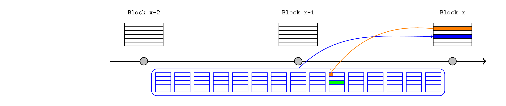

# Preemptive Provable Assertions

## Overview

I'd like to describe a mechanism to extend the flexibility of rollups. The core insight was introduced in Nethermind's [Same Slot L1->L2 Message Passing](https://ethresear.ch/t/same-slot-l1-l2-message-passing/21186) design and I would generalise it to the statement:

> L2 users (and contracts) can rely on arbitrary assertions about future state, provided their transactions are conditioned on those assertions eventually being proven.

This article will unpack that statement and provide some example use cases. We will cover:

- Background information about rollup communication, focussing on timing.
- Anchor blocks for reading L1 state.
- A structure to generalise the same-slot message passing mechanism.
- A mechanism for realtime L1 reads.
- A mechanism for interdependent L2 transactions.
- A mechanism for cross-rollup assertions.

## Background

Every 12 seconds, Ethereum selects an L1 proposer that can aggregate new L1 transactions into a block and add it to the chain. 

L2 transactions are derived from data published in an L1 transaction. Typically, they are aggregated into L2 blocks with a shorter block time, so there are several L2 blocks per L1 block.

We are also focussed on potential functionality that can be offered by an L2 sequencer with monopoly rights until a particular slot, typically spanning several L1 blocks (although just two are depicted here).

Such a sequencer would be partially limited in their flexibility to reorganise L2 transactions over several slots, because they may offer preconfirmations or liveness guarantees to users. Whenever we discuss a transaction occurring on L2 before it is actually published to L1, we really just mean that it can influence later transactions and the sequencer is unlikely to remove or delay it. For simplicity, this article will default to describing L2 blocks as if they are continuously created and finalized in real time.

## Anchor blocks

We need a mechanism to send messages from L1 to L2, so that L2 users and contracts can react to L1 activity. I will describe Taiko's standard architecture, although the concepts are broadly applicable across rollups.

The L2 sequencer is required to start each block with an _anchor transaction_, and pass in a recent L1 block number and state root as arguments. Any user can then prove that a particular storage value is consistent with the latest state root, and the rest of the chain can proceed with this knowledge.

For example, consider a snapshot spanning a cross-chain token deposit and a few subsequent L2 blocks:

- an L1 bridge contract receives the tokens and records this fact in L1 storage (the dark green transaction in the below diagram).
- the L2 sequencer passes the latest L1 state root (pink) to the anchor transaction at the start of an L2 block.
- the token recipient (or anyone else) provides a Merkle proof to an L2 bridge contract demonstrating that the deposit was saved under the relevant storage root within the L1 state root. This convinces the L2 bridge that the deposit occured on L1, so it releases or mints the L2 tokens (light green).
- those tokens are now immediately available to interact with the rest of the L2 ecosystem in future transactions and blocks.

Note that at this point the sequencer has directly asserted the L1 state without justification. Although it is public information (in the sense that anyone can retrieve the value from an L1 node), this cannot be validated from inside the L2 EVM so L2 contracts must simply trust that it was correct. A sequencer that passes an invalid state root could fabricate a plausible alternate history that would be self-consistent from within the L2 EVM. This is eventually resolved when the bundle is published to the L1 inbox contract, which queries the relevant block hash so it can be compared to the injected state root.

### Security architecture

Let's review the security architecture implied by this mechanism. Constraints on L2 sequencers can be categorised as either:
- rules of the rollup, enforced by the L2 nodes and validity proofs.
- other commitments (such as preconfirmations), enforced by economic stake and reputation.

The anchor block requirement (and other assertions described in this article) fall into the first category. This means that all relevant information needs to be available on L1 and when using ZK or TEE proofs, it also needs to be verifiable from within the L1 EVM. This is achieved by some combination of:
- performing relevant validations in the L1 Inbox contract at publication time.
- saving a hash of the available information at publication time, so it can be use to constrain the inputs to an off-chain proof.

In this case, the complete procedure is:
- the sequencer reads the latest L1 state and block number from their node.
- the sequencer passes these values to the anchor transactions, which saves them in the L2 state.
    - in the Taiko case there is an anchor transaction per L2 block but only ones that update the latest L1 state are relevant for this article.
- the sequencer continues to build L2 blocks, and possibly preconfirms them.
- eventually the sequencer submits the whole bundle to the L1 Inbox contract.
- the Inbox contract calls `blockhash(anchorBlockNumber)` and saves (a hash of) it along with the publication.
- the rollup's state transition function, implemented by the rollup nodes, validates the consistency of the entire bundle, which includes confirming (among many other things) that:
    - the anchor transaction is called exactly once at the start of every block.
    - the block number and state root arguments are consistent with the block hash queried by the L1 inbox.

In this way, a sequencer that asserts the wrong state root would invalidate the whole publication, just like they would if they violated any other state-transition rules, like exceeding the block gas limit. Any L2 transaction that reacted to the invalid root (by minting tokens that did not have a matching L1 deposit, for instance) would be contained inside an invalid publication, so it would not be included in the final transaction history.

As we have seen, the sequencer's claim when constructing the anchor transaction is not strictly "this is the state root of the latest L1 block" but rather "this state root is consistent with the block hash that will be retrieved in the publication block". This describes a general pattern that we can use whenever:

- the sequencer knows something that they want to assert inside the L2 EVM, so that L2 users and contracts can build on it.
- the information needed to prove the claim will eventually be verifiable in the L1 EVM at publication time.
- the rollup's state transition function requires the claim to be proven for the publication to be valid.

## Same Slot Message Passing

This idea was [introduced by Nethermind](https://ethresear.ch/t/same-slot-l1-l2-message-passing/21186) and as noted in that post, it can be combined with their fast-withdrawal mechanism to perform a same-slot round-trip operation. Here I will just focus on the assert-and-prove structure of the L1-to-L2 message.

As noted, the anchor block mechanism requires the Inbox contract to query the block hash of the relevant L1 block, which implies it cannot be used to react to transactions included in the current L1 block. However, an L2 sequencer that can predict a particular L1 transaction will be included in the publication block (either because this is a based rollup or the sequencer has seen an L1 preconfirmation) can assert that claim immediately in the L2.

