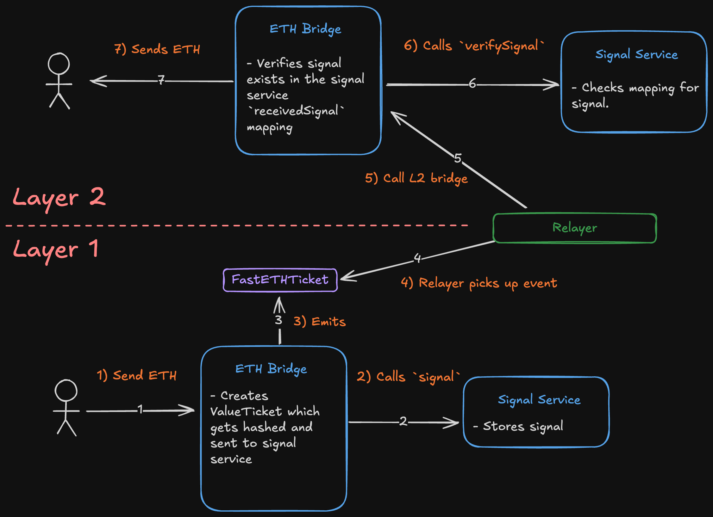

# Signals

The minimal rollup stack refers to cross-chain message passing as "signalling". Signalling involves writing to a storage location so that it can later be proven on a **destination chain** using a storage proof for a trusted L1 state root.

A storage proof is a [Merkle proof](https://en.wikipedia.org/wiki/Merkle_tree) showing that a value is stored at a specific storage slot. This proof is generated by the L1 chain and can be verified by the L2 chain as long as the root hash of the **source chain** state is available on the **destination chain**.

A signal has the following properties:

- Scoped to a specific chain and account: The same signal will generate a different storage slot on different chains. This ties the account and state root to the chain.
- Contains a `bytes32` value: May represent a hash of a message or any other value type that can be stored in a single EVM word.
- Can't be deleted: Once a signal is stored, it remains in storage indefinitely.

For the purpose of deriving the storage slot for a signal, we use the [ERC-7201](https://github.com/OpenZeppelin/openzeppelin-contracts/blob/ca7a4e39de0860bbaadf95824207886e6de9fa64/contracts/utils/SlotDerivation.sol#L4) standard formula to create a unique storage slot for each signal that does not collide with other values stored in the same contract. The id of the signal consists of `msg.sender`, `chainId` and `value`.

### L1 -> L2 Same-slot signalling

Nethermind's [proposal on same-slot L1 -> L2 message passing](https://ethresear.ch/t/same-slot-l1-l2-message-passing/21186) outlines the concept of signals injected by the L2 proposer into the L2, allowing to bypass the wait for the next L1 state root. The following describes the approach to implement both 'slow' and 'fast' signalling pathways using this minimal rollup stack.

#### Normal ('slow') Signalling

The simplest form of signalling requires waiting for the next **source chain** state root to be available on the **destination chain** via a trusted mechanism. In the case of L1 → L2 communication, the latest available L1 root is included in the L2 batch by the proposer in an anchor transaction.

Using the signal requires the following steps:

1. Store a signal on the L1.
2. Wait for the next L2 batch to be proposed on the L1.
3. Verify the signal in your L2 application using the latest L1 root to trigger some logic.

However, the waiting period forbids immediate communication between the two chains since users need to wait for the next L1. This is where the 'fast' signalling pathway comes in.

#### Same Slot L1 → L2 ('fast') Signalling

In the 'fast' signalling pathway, the L2 proposer can assist an application to bypass the waiting period for the next L1 state root by injecting the signal into the L2 chain. This is done by the L2 proposer listening to the L1 signal and including it in the L2 block proposal.

Using the signal requires the following steps:

1. An application on the L1 stores a signal in the SS.
2. The L2 proposer listens to any signal being stored on the L1 SS.
3. After building a block and obtaining a commitment, the L2 proposer submits a transaction batch to their L1 inbox contract. This batch includes an anchor transaction where the proposer injects the L1 state root and the signals that were stored on the L1 SS.
4. The inbox contract verifies that the signals exist in the L1 SS using a storage proof with the L1 state root that was just injected.
5. The L2 proposer calls `receiveSignal` on the L2 SS through the anchor transaction executed at the start of L2 blocks. This fills a mapping of `_receivedSignals` to true (signal —> true).
6. Any application that requires same slot signalling will just verify the signal is found in the `_receivedSignals` mapping (i.e. they don’t need to provide a storage proof).

A corner case is that where an L2 proposer decides not to receive one of the signals stored in the L1 SS within the anchor transaction, making any application using the signal (as in step 6) revert. In those cases, the application can always fallback to the 'slow' signalling pathway given the signal can't be deleted and the user can always wait for the next L1 state root. Applications can build mechanisms to incentivize proposers to include their signals in the L2 anchor transaction.

In the context of an L2 proposer who also issues preconfirmations (either by delegation or any other mechanism), then the inclusion of the signal in the L2 block is guaranteed. Otherwise, the verification at step 4 will fail, reverting the whole L2 batch.

Considering that [_relying on same-slot L1 messages for L2 execution creates a tight coupling between L1 and L2_](http://ethresear.ch/t/same-slot-l1-l2-message-passing/21186#p-51604-are-shared-sequencersbuilders-needed-here-7) as they would _reorg_ together, it's recommended for applications developers to build mechanisms that are resilient to reorgs. However, the ability to create atomic L1 <> L2 execution remains, as they can always write applications that enforce atomicity (e.g. [fast (and slow) L2 -> L1 withdrawals](https://ethresear.ch/t/fast-and-slow-l2-l1-withdrawals/21161)).

---

## Application Examples

### State root fast-tracking

An application that requires immediate access to the latest L1 state root can use the fast signalling to fast-track it into the L2 in a permissioned way. The mechanics to deal with invalid or untrusted state roots are left to the application.

For example, enabling the anchor transaction can be implemented as an application of a signal itself.

### Asset Bridging

Bridging assets over to L2 requires an application that signals the value and asset to be bridged. On the source chain, some mechanism will lock the asset and produce a signal. On the L2, the user can claim the assets by verifying the signal and the L1 state root.

#### ETH Bridge

The L2 ETH bridge is presumed to have unlimited ETH, functioning as the canonical bridge for transferring assets to Taiko rollups. The ETH bridge makes use of both 'fast' and 'slow' signalling pathways as described above, allowing users to choose between immediate transfers with potential higher costs and slower transfers with lower fees, depending on their specific needs.

**Slow ETH deposits**

Below is a diagram showing the 'slow' ETH bridging pathway. The L2 ETH bridge requires the latest L1 state root (containing the L1 signal) to verify the L1 storage proof.

**Fast ETH deposits**

In contrast here is diagram showing the 'fast' signalling pathway. In this scenario the L2 ETH bridge can just verify that the signal is present in the L2 `receivedSignal` mapping instead of relying on the L1 state root. This mapping would have already been filled when the block was proposed.

In either case however, the message being stored consist of the `destinationChainId`, `nonce` (to prevent storage collision), `from` address, `to` address and `value` (amount of ETH). These values form a `ValueTicket`. The `ValueTicket` is hashed and stored as the `value` of the signal.

### Token Bridges

The current repository does not include token-specific bridges (as these are more application-specific and not considered 'core' to the protocol). However, these would presumably use the same mechanisms as the ETH bridge, leveraging both fast and slow signaling as appropriate for different token transfer scenarios.

Popular token bridges (e.g. erc20, erc721) will perhaps be added at a later date.

## Future Considerations

- **Merging fast and slow pathways in the SS**: Creating a unified signal service that deals with both the fast and slow signals.
- **L2 → L1 fast withdrawals using solver [network](https://ethresear.ch/t/fast-and-slow-l2-l1-withdrawals/21161)**: Implementing a network of solvers which could dramatically improve withdrawal times from L2 to L1.
- **Signal storage optimisation**s: Currently, signals cannot be cancelled and are stored indefinitely. We could explore allowing cancellable signals or reusing storage to improve efficiency.
- **Cross-rollup communication**: Extending the signalling mechanism to enable direct communication between different L2 solutions
- **Intent protocols**: As part of the stack, application presets can be included so that rollup developers can implement intent protocols to incentivize the inclusion of signals in the L2 block.
- **[ERC-7786](https://eips.ethereum.org/EIPS/eip-7786) Gateway**: An ERC-7786 gateway can orchastrate other applications based on signals. This could be used to create a more complex application that requires multiple signals to be included in the L2 block.
