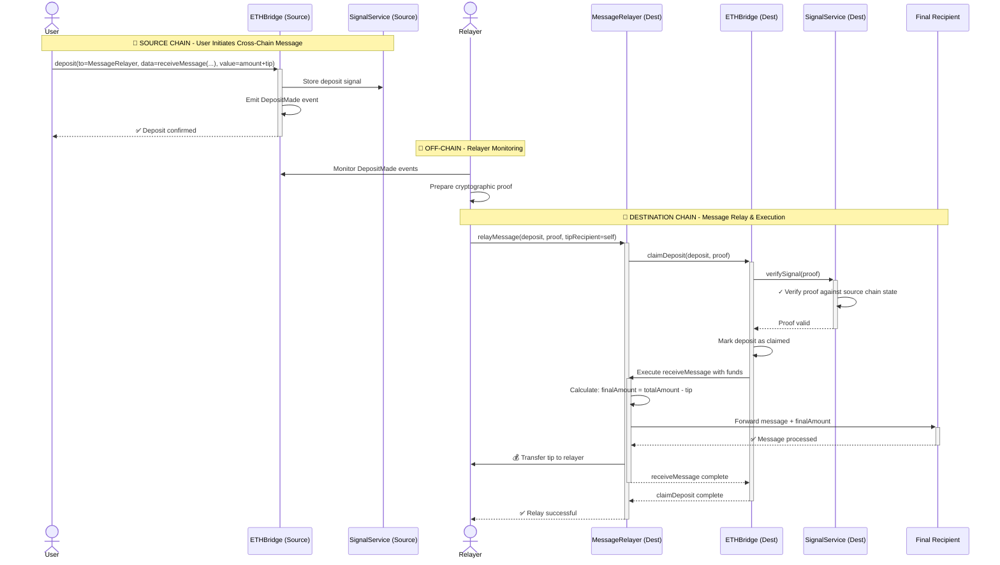

# Brdiging Eth using the MessageRelayer

Here's the flow from user's sending ETH on the source chain to that ETH being distributed on the destination chain. This flow includes the `MessageRelayer` that provides a way for users to incentivize an off-chain relayer to claim the deposit on their behalf on the destination chain.

## Flow Overview

### 🚀 **Step 1: User Initiates (Source Chain)**

The user wants to send a message and ETH to the destination chain but doesn't want to manually complete the process there.

- **What happens:** User calls `deposit()` on source chain ETHBridge
- **Key details:**
  - `to` = MessageRelayer contract address on destination chain
  - `data` = encoded call to `receiveMessage(finalRecipient, tip, gasLimit, messageData)`
  - `value` = amount for final recipient + tip for relayer
- **Result:** Deposit is recorded as a "signal" and event is emitted

### 🔍 **Step 2: Relayer Monitors (Off-Chain)**

Third-party relayers watch for deposit events and decide which ones to process.

- **What happens:** Relayer detects profitable deposit and prepares proof
- **Key details:** Relayer constructs cryptographic proof that the deposit exists in source chain state
- **Incentive:** Relayer expects to earn the tip specified in the deposit

### ⚡ **Step 3: Message Relay (Destination Chain)**

The relayer triggers the cross-chain message execution and gets paid.

- **What happens:**
  1. Relayer calls `relayMessage()` on MessageRelayer
  2. MessageRelayer calls `claimDeposit()` on destination ETHBridge
  3. ETHBridge verifies the proof against source chain state via SignalService
  4. If valid, ETHBridge executes `receiveMessage()` on MessageRelayer with the funds
  5. MessageRelayer forwards (amount - tip) to final recipient
  6. MessageRelayer pays tip to relayer

- **Result:**
  - ✅ Final recipient receives their message and funds
  - ✅ Relayer receives their tip
  - ✅ Cross-chain message is complete
