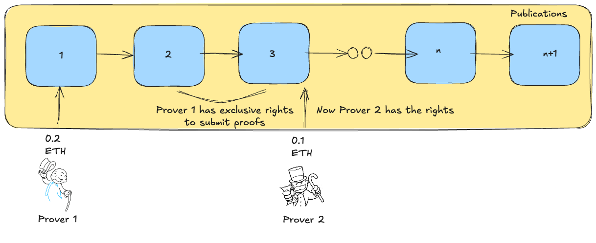

# Efficient prover incentives

This document describes an ahead of time auction mechanism that allows provers to bid for the right to prove multiple publications for a rollup. The mechanism is designed with the following principles in mind:

- Decouple the roles of proposing and proving.
- The right to prove is assignned to a single prover at a time, avoiding races to prove the same batches, which results in cheaper costs.
- Known cost for proposers when submitting a publication.
- Simple and minimal L1 gas costs.

*The specifics of the mechanism are still being discussed, and some of the details might change as we do more research on the incentives.*

## The problem

Verifying proofs on the Ethereum L1 is a [costly operation](https://docs.alignedlayer.com/#why-are-we-building-aligned) in terms of gas. Groth16 proofs, which are some of the cheapest to verify cost around 250k gas, while STARKS cost over 1M gas. Because of this, most zk rollups call the verification function of their inbox contract only sporadically.  

We would like to get a similar property for validity Based rollups - but that opens the question, who should verify the batches submitted to the L1 and how can we incentivize proposers to submit valid batches if they don’t get proven immediately? A common approach to this is to force proposers to deposit a bond when they submit a batch, and force them to provide a validity proof within a time window, otherwise they lose their stake and proving becomes permisionless. This is the approach deployed on [Taiko](https://docs.taiko.xyz/resources/terminology/#validity-bond) today.

- After the pacaya fork, there is now an option to prove multiple non consecutive batches(and anyone can do it), but if the batch is within its proving window(60 minutes as of this writing) the rewards goes to the proposer.
This is a bit more flexible, but the incentives are basically the same - each proposer is incentivized to prove or get a prover for their batches only, which does not result in the most efficient proving costs. If the proposers are sophisticated enough, an off-chain market may develop, where different proposers pay the same prover to generate a proof for their batch, and the prover may aggregate those proofs in order to get a more efficient result. This is still uncertain, and it may even have a very centralizing effect, since provers are incentivized to make a deal with as many proposers as possible to ensure they can prove consecutive batches and get paid off-chain(if different batches have proposers that have chosen different provers then none of them will be incentivized to prove the entire set).
- This also has the downside that you have to store multiple checkpoints in the Inbox contract, because proving may happen out of order.

## Proposed design

Anyone that wants to be a prover can register as the designated prover by signaling how much they are willing to charge **on a per publication basis**. The prover that offers the lower amount gets monopoly rights to prove publications until someone else comes in and offers a lower cost per publication. This way proposers know exactly how much they will have to pay to get their publication proven, and are not required to put additional capital, making the system more capital efficient.  
New participants that want to undercut the current prover need to offer a lower price per publication that **is at least a defined percentage lower** than the current prover or other participants. This is to avoid gas wars common in auctions where the new participant just offers one wei less than the current best offer.  

*This system effectively behaves as a reserve english ahead of time auction.*

While publications will differ in proving cycles they require, the prover should account for this variation and since we don’t have a proper way to calculate this on the L1 they should choose this value on an average case basis.

In order to prevent a malicious provers to opt in and be inactive, we require them to put stake when opting in. This stake is then slashed if they don’t comply and can be used to reward the next prover(since they might ask for a higher price for providing the service and proposers had already paid the previous amount).

*The amount that provers are required to stake is not yet defined, but should be enough to serve as an incentive for other provers to step in if the current prover becomes inactive.*

### Transition Periods

The ideal system is one where a prover has the right for an extended period of time. This allows them to aggregate proofs for multiple publications and post them in a single L1 transaction, reducing the on-chain costs.  
We want to avoid scenarios where provers are constantly changing, since this would result in less efficient proving costs and a lot of unpredictablity for provers. The good news is that this should happen naturally, as the price per publication they charge should converge to the cost of proving. But we still introduce a transition period when a prover is outbid or wants to exit.

- `succesionDelay` is the time window between when the prover is outbid and when the new prover can start their period. During this time other interested provers or the existing one can come in and offer an even lower price.
- `exitDelay` is the time window between when the prover wants to exit and when the new prover can start their period. It is also the time window between when an inactive prover is ejected and when the new prover can start.

**We call the proving window(the time and the publications that are assigned to a specific prover) a `period`.**
Provers are only rewarded for the publications they proved within their period and returned their stake after their period is closed(all the publications have been proven).

### Fallback Mechanism

What happens if the prover does not deliver on their promise and does not prove anything after a certain period of time? We now need a new prover to step in. Anyone can calll `eject` to receive a portion of the prover's stake and mark them as inactive. This marks the current prover as ready to be slashed(we will discuss the details in a later section) and allows a new prover to step in(an auction occurs during the `exitDelay` window described in the section above).

*In the case no independent prover is willing to step in for whatever reason, or the ones that are collude and decide to charge an insane amount, the system can still maintain liveness assuming the rollup operator is willing to run a prover and is assumed not to want to extract excessive value from their users.*

At this point you may wonder what we do with the unproven publications from the offender prover? The way we deal with this currently is by **making proving those publications permisionless**, and rewarding the prover that proves them with a portion of the offender's stake while burning the rest(how much is burned or if it is actually sent to the treasury instead of burned is yet to be defined). The fees for the unproven publications are paid to the new prover, and the fees for the ones that were already proven by the offender are still paid to them.

### Dealing with forced inclusions

**How to deal with forced inclussions is still being discussed. This section describes our current thinking on the subject.**

In our current design, forced transactions are still posted as blobs, but go to a separate queue and are picked when the next proposer calls publish on the Inbox to post their next publication. For now we have decided that they will be posted as a new publication inside the same function call(a new publication is cleaner, easier to price and avoids the risk of a single combined publication being too big to prove).

But we now have a problem to solve: how do we price these delayed publications? Should we charge the forced includer or allow them to free ride the next proposer?
While we don’t always know exactly the proving cost when their transactions will be included(since the current prover turn might be over by the time this publication is included), allowing a free ride creates negative incentives, where actors are incentivized to batch as many transactions as they can and post them in a delayed publication, giving them a lower execution price as long as they are willing to wait that time for their inclusion. This penalizes the prover, who now has to prove a very big publication that he is not compensated for(or the proposer if we make him pay for the publication).

The proposed solution is to ask the delayed proposer to also pay a proving fee, **but this should be higher than the regular proving fee** because of:

1. Their publication are potentially much larger than the regular proposer publication(since they can accumulate transactions for an arbitrarily large amount of time and are limited by DA only)
2. Proving cost is not always known, so it might actually go up by the time it is time to prove their publication
3. We want to disincentivize the formation of a market where an actor batches multiples transactions from people and include that with a delay just because it is cheaper. Unless you are getting censored you should go trough the regular flow.
