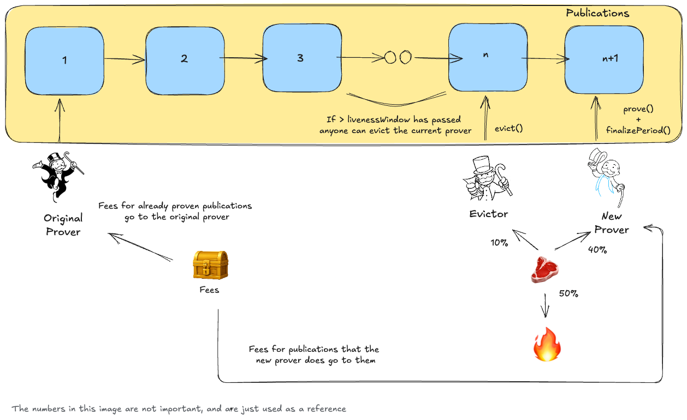

# Efficient prover incentives

This document describes an ahead-of-time auction mechanism that allows provers to bid for the right to prove multiple publications for a rollup. The mechanism is guided by the following principles:

- Decouple the roles of proposing and proving.
- Assign proving rights to one prover at a time to avoid redundant efforts, resulting in lower costs for users.
- Provide proposers with predictable costs when submitting publications.
- Maintain a simple design and minimal L1 gas costs.

> [!NOTE]
> An initial implementation of this design can be found in the [ProverManager contract](../src/protocol/taiko_alethia/ProverManager.sol).

*The specifics of the mechanism are still under discussion, and some details may change as we conduct further research into incentives.*

## The problem

Verifying proofs on Ethereum L1 is a [gas-intensive operation](https://docs.alignedlayer.com/#why-are-we-building-aligned). For example, Groth16 proofs, among the cheapest, cost around 250k gas, while STARKs can exceed 1M gas. Consequently, most zk-rollups call their inbox contract's verification function only sporadically.

For based validity rollups, achieving a similar property raises the question: Who should verify batches submitted to L1, and how can proposers be incentivized to submit valid batches if proofs aren't generated immediately? A common solution is to require proposers to deposit a bond when submitting a batch. If they fail to provide a validity proof within a set time window, they lose their stake, and proving becomes permissionless. Taiko currently uses this approach.

In Taiko, after the Pacaya fork, proving multiple non-consecutive batches will become possible (open to anyone). However, rewards go to the proposer if a batch is within its proving window (currently 60 minutes). While this adds flexibility, incentives remain largely unchanged: proposers are motivated to prove only their batches (either running a prover themselves or paying a prover), which doesn't optimize proving costs.

If proposers are sophisticated enough, an off-chain market might develop where multiple proposers pay the same prover to generate proofs for their batches. The prover can then aggregate these proofs for greater efficiency. However, this scenario is uncertain and could lead to centralization, as provers seek deals with as many proposers as possible to maximize consecutive batches. Even if this market emerges, several concerns remain:

- If batches have different provers, none may be incentivized to prove the entire set.
- The rollup must store multiple checkpoints in the Inbox (or another contract), as proving may happen out of order, increasing storage costs.
- Payments occur off-chain, and the protocol lacks visibility or control over incentives.
- It may lead to proposer centralization, since it rewards proposers who form sophisticated off-chain agreements.

## Proposed design

We propose an on-chain auction where the protocol maintains visibility and control over incentives.

Anyone can register as a designated prover by specifying their fee **per publication**. The prover offering the lowest fee gains exclusive rights to prove publications until another prover undercuts them with a lower fee. This ensures proposers know the exact cost of proving their publications upfront, eliminating the need for additional capital and improving capital efficiency and participation.
To prevent bidding wars (i.e., new participants undercutting by just one wei) that can cause unnecessary gas spikes, new provers must offer a fee that is **at least a defined percentage lower** than the current lowest fee.

*This system functions effectively as a reverse English auction conducted ahead of time.*

While publications vary in proving cycles required, provers should account for this variability. Since L1 cannot calculate these differences, provers should base their bids on an average case.

To deter malicious or inactive provers, they must stake funds when registering by putting a `livenessBond` as collateral. This stake is slashed if they fail to fulfill their duties and can be used to reward the next prover (who may charge a higher fee, even though proposers have already paid the previous amount). We introduce a `livenessWindow`, which is the maximum time a prover can take to prove a publication. If the prover doesn't prove the publication within this time, they can be evicted by anyone for a portion of their stake(more details in the [Fallback Mechanism](#fallback-mechanism) section).

*The required stake amount is yet to be defined but should be sufficient to incentivize other provers to step in if the current prover becomes inactive.*

### Transition periods

Ideally, a prover has exclusive rights for an extended period, enabling aggregation of proofs for multiple publications, submitted in a single L1 transaction, reducing on-chain costs.

Frequent prover changes should be avoided due to inefficiency and unpredictability. This is naturally incentivized, as provers' fees should converge to actual proving costs. However, transition periods manage scenarios where a prover is outbid, exits voluntarily, or is evicted due to inactivity:

- **successionDelay:** Time between a prover being outbid and the new prover starting their period. Other provers (including the current one) may offer a lower fee during this window.
- **exitDelay:** Time between a prover requesting exit (or being evicted for inactivity) and the new prover starting their period.

**We refer to the proving window (the time and publications assigned to a specific prover) as a `period`.**
Provers earn rewards only for publications proven within their period and regain their stake when they finalize their period (after all assigned publications are proven).

### Fallback mechanism

If a registered prover fails to deliver a proof within the `livenessWindow`, anyone can call the `evictProver` function, claiming part of the inactive prover's stake and marking them inactive. This flags the prover for slashing and initiates an auction during the `exitDelay` window for selecting a new prover.

Unproven publications from the evicted prover become permissionless. The prover who successfully proves them receives part of the evicted prover’s stake; the remainder is burned or sent to the treasury(we plan the stack to support inidivudal rollups to choose how they want to distribute this). Fees for unproven publications go to the new prover, while fees for publications already proven remain with the original prover. Another option was to assign the rights to prove these publications to the prover who wins the auction for the next period, but then we need to handle the fallback mechanism for them as well. For now, we opted for the simpler approach.

### Dealing with forced inclusions

**Handling forced inclusions is still under discussion. This section describes our current thinking.**

In our current design, forced transactions are posted as blobs but are routed to a separate queue. They are picked up when the next proposer calls `publish` on the Inbox to submit their publication. For now, we’ve decided that forced transactions will be posted as a **new publication** within the same function call. This approach is cleaner, easier to price, and avoids the risk of a single combined publication becoming too large to prove.

However, pricing delayed publications raises questions: Should the forced includer pay, or should they free-ride on the next proposer?

While the exact proving cost at the time of inclusion may be uncertain (since the current prover’s term might have ended), allowing free-riding creates negative incentives. Actors could batch as many transactions as possible into delayed publications, securing a lower execution price by waiting for inclusion. This penalizes the prover (who must prove a large publication without adequate compensation) or the proposer (if they are forced to cover the cost).

The proposed solution is to require the delayed proposer to pay a proving fee, **set higher than the regular fee** for the following reasons:

1. **Size:** Delayed publications can accumulate transactions over an arbitrarily long time, making them potentially much larger than regular publications (limited only by data availability).
2. **Uncertainty:** Proving costs may increase by the time the publication is included.
3. **Incentives:** Discourages actors from batching transactions purely to reduce costs.

> [!NOTE]
> This has not been implemented yet, and pricing delayed publications differently has the practical downside that we need to keep track of individual publications fees on the ProverManager contract, which increases storage costs.

## Alternatives

Is an on-chain incentive mechanism the only solution? No, but it's currently the most practical and can be combined with future approaches. Here are some of the alternatives we explored:

- Off-chain market: Some of the dynamics of the proposed design can be achieved off-chain, but the incentives remain outside of the protocol's control and has some negative externalities described in the [The problem](#the-problem) section.

- [Aggregation layers](https://ethereum-magicians.org/t/a-simple-l2-security-and-finalization-roadmap/23309#p-56644-h-3-work-on-aggregation-layers-3) can help solve this problem by amortizing the costs among multiple rollups, but we still don't have common standards and a layer that does not introduce new security tradeoffs. Eventually, we want rollups to post proofs to L1 every slot, but we are still away from that. Even when using aggregation across multiple rollups, it will be useful to have a mechanism to allow a single prover to generate proofs for multiple consecutive batches.
